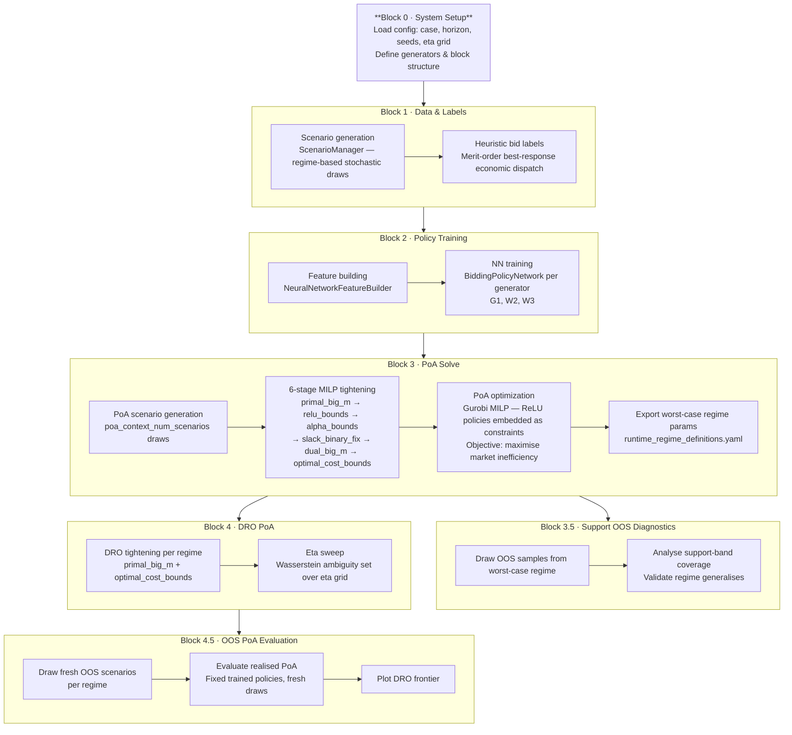

# Pipeline overview

```mermaid
flowchart TD
    B0["**Block 0 · System Setup**\nLoad config: case, horizon, seeds, eta grid\nDefine generators & block structure"]

    B0 --> B1

    subgraph B1["Block 1 · Data & Labels"]
        B1a["Scenario generation\nScenarioManager — regime-based stochastic draws"]
        B1b["Heuristic bid labels\nMerit-order best-response economic dispatch"]
        B1a --> B1b
    end

    B1 --> B2

    subgraph B2["Block 2 · Policy Training"]
        B2a["Feature building\nNeuralNetworkFeatureBuilder"]
        B2b["NN training\nBiddingPolicyNetwork per generator\nG1, W2, W3"]
        B2a --> B2b
    end

    B2 --> B3

    subgraph B3["Block 3 · PoA Solve"]
        B3a["PoA scenario generation\npoa_context_num_scenarios draws"]
        B3b["6-stage MILP tightening\nprimal_big_m → relu_bounds → alpha_bounds\n→ slack_binary_fix → dual_big_m → optimal_cost_bounds"]
        B3c["PoA optimization\nGurobi MILP — ReLU policies embedded as constraints\nObjective: maximise market inefficiency"]
        B3d["Export worst-case regime params\nruntime_regime_definitions.yaml"]
        B3a --> B3b --> B3c --> B3d
    end

    B3 --> B35
    B3 --> B4

    subgraph B35["Block 3.5 · Support OOS Diagnostics"]
        B35a["Draw OOS samples from worst-case regime"]
        B35b["Analyse support-band coverage\nValidate regime generalises"]
        B35a --> B35b
    end

    subgraph B4["Block 4 · DRO PoA"]
        B4a["DRO tightening per regime\nprimal_big_m + optimal_cost_bounds"]
        B4b["Eta sweep\nWasserstein ambiguity set over eta grid"]
        B4a --> B4b
    end

    B4 --> B45

    subgraph B45["Block 4.5 · OOS PoA Evaluation"]
        B45a["Draw fresh OOS scenarios\nper regime"]
        B45b["Evaluate realised PoA\nFixed trained policies, fresh draws"]
        B45c["Plot DRO frontier"]
        B45a --> B45b --> B45c
    end
```
